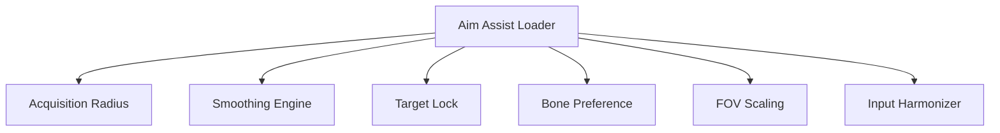

## Overview

Operating as a runtime targeting layer, **PUBG: BLINDSPOT Aim Assist** adjusts aim-related calculations during active sessions in PUBG: BLINDSPOT. The system focuses on acquisition logic, input smoothing, and target alignment without modifying stored assets or configurations. Common secondary associations include aim assist module, targeting controller, precision adjustment system, and runtime input modifier. All changes are applied dynamically, remain session-bound, and revert upon unload.

---

## Target Acquisition Radius Control

* Configurable detection cone
* Distance-weighted target selection
* Priority switching logic

**In-game behavior:**
Refines how nearby targets are identified and selected based on spatial proximity and angle.

---

## Aim Smoothing Engine

* Adjustable interpolation curves
* Snap-to-target delay tuning
* Micro-correction damping

**Feature intent:**
Balances responsiveness with stability by smoothing input transitions during target alignment.

---

## Target Lock Management

* Soft-lock engagement toggle
* Lock persistence duration
* Automatic disengage thresholds

**In-game behavior:**
Maintains controlled alignment on a selected target while respecting defined break conditions.

---

## Bone and Hitbox Preference Layer

* Selectable target zones
* Offset calibration controls
* Dynamic zone switching

**Feature intent:**
Directs aim calculations toward preferred hit regions without altering hitbox definitions.

---

## Field-of-View Scaling

* Aim assist FOV adjustment
* Peripheral influence limits
* Context-aware scaling

**In-game behavior:**
Scopes the effective assist area to reduce unintended target pulls outside the intended view.

---

## Input Sensitivity Harmonizer

* Axis-specific sensitivity matching
* Device-aware tuning
* Realtime sensitivity override

**Feature intent:**
Aligns assist behavior with current input settings to maintain consistent control feel.

---

## Aim Assist Menu and Hotkeys

* Toggle-based module control
* Profile presets per weapon class
* Safe unload with state reset

**In-game behavior:**
Enables rapid configuration changes without interrupting standard input flow.

---

---

## FAQ

**Does aim assist replace native aiming?**
No, native input remains active alongside adjusted targeting parameters.

**Are configurations persistent?**
Profiles can be saved, but effects apply only during active sessions.

**Can assist strength be reduced to zero?**
Yes, all assist layers support full disablement.

**Does it affect all weapons equally?**
Weapon-class presets allow differentiated behavior.

**Is there a quick reset option?**
A global reset restores default targeting behavior before unload.

**Can the menu be hidden?**
Yes, visibility is controlled via hotkeys.

---

## Feature Summary

* Target acquisition radius tuning
* Aim smoothing and interpolation control
* Soft-lock targeting management
* Bone and hitbox preference routing
* Assist FOV scaling
* Input sensitivity harmonization
* Modular menu with hotkey control

---
